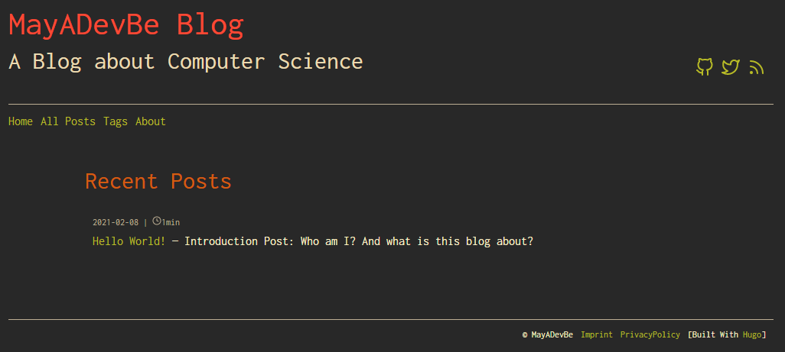

# Hugo-Gruvbox-Theme

Simple personal blog/portfolio theme for Hugo.

Inspired by the [Ezhil](https://github.com/vividvilla/ezhil) theme and with the colors from [Gruvbox](https://github.com/morhetz/gruvbox).

## Features

- Gruvbox theme
- Minimal
- Responsive
- Supports tags
- Social Media Links
- Syntax highlighting (Gruvbox)
- Twitter cards + opengraph support
- Hugo RSS feed
- Reading Time of Posts
- Google Analytics (+ Simple Cookie Banner)
- Post Sharing Button
- Utterances Comments Feature support
- TableOfContents styled

## Demo

[View Website](https://mayadevbe.me/)


[Erik Zaadis Blog](https://erikzaadi.com/) is now also using this theme.

## Installation

- clone
  From the Hugo-Site folder
  ```
  cd themes
  git clone https://github.com/MayADevBe/Hugo-Gruvbox-Theme.git
  ```
- download
  Unzip into the 'themes' folder

- optional: in the layouts folder configure the 'robots.txt' file
(default allows all user-agents and no disallows, but no sitemap link)

For more information checkout the [Hugo Installation Guide](https://gohugo.io/getting-started/installing/)

## Configuration

- Put a favicon in 'static\ico\favicon.svg'
- 'config.toml' example:

```toml

baseURL = "http://example.com/"
languageCode = "en-us"
title = "Website Name"
theme = "Hugo-Gruvbox-Theme"

copyright = "© Copyright Notice"

#For Pagination
pagination.pagerSize = 5

enableRobotsTXT = true

[params.author]
name = "Author Name"
email = "authorname@gmail.com"

[params]
    # Blog subtitle + For Twitter cards
    description = "A Blog about ..."
    #Google Analytics Tracking ID
    googleAnalytics = "UA-xxxxxxxxx-x"
    # Related Posts
    enableRelatedPosts = true
    relatedPostsNumber = 2
    #For Utterances Comments Feature - need to add repo
    commentRepo = "GithubName/PublicRepoName"

#Main Menu (below header)
[[menu.main]]
name = "Home"
url = "/"
weight = 1

[[menu.main]]
name = "All Posts"
url = "/posts"
weight = 2

[[menu.main]]
name = "Tags"
url = "/tags"
weight = 3

[[menu.main]]
name = "About"
url = "/about"
weight = 4

#Footer Menu
[[menu.footer]]
name = "Imprint"
url = "/imprint"
weight = 1

[[menu.footer]]
name = "PrivacyPolicy"
url = "/privacypolicy"
weight = 2

# Social Media Links (in header)
# Uses feather icons (search icon names on the site)
[[params.social]]
name = "Github"
icon = "github"
url = "https://github.com/MayADevBe"

[[params.social]]
name = "Twitter"
icon = "twitter"
url = "https://twitter.com/MayADevBe"

#enable tags
[taxonomies]
  tag = "tags"

# allow raw HTML
[markup]
  [markup.goldmark]
    [markup.goldmark.renderer]
      unsafe = true

# Syntax Highlighting
pygmentsUseClasses = true
pygmentsCodefences = true
[markup.highlight]
    codeFences = true
    guessSyntax = true
    hl_Lines = ""
    lineNoStart = 1
    lineNos = true
    lineNumbersInTable = true
    tabWidth = 4
    noClasses = false

# Table of content depth and list type
[markup.tableOfContents]
  endLevel = 4
  ordered = false
  startLevel = 2

#related config
[related]
  includeNewer = true
  threshold = 80
  toLower = true

  [[related.indices]]
    name = "tags"
    weight = 100

  [[related.indices]]
    name = "date"
    weight = 10

```

### Simple Cookie Banner

- shows up when Google Analytics is used
- because of DSGVO
- contains link to privacy policy (BaseURL/privacypolicy)
  - can be change in static/js/purecookie.js line 4: `purecookieLink`
  - adds google analytics consent in head.html

## Credits

- [Ezhil](https://github.com/vividvilla/ezhil)
- [Gruvbox](https://github.com/morhetz/gruvbox)
- [Feather Icons](https://feathericons.com/)
- [Sharing Buttons](https://sharingbuttons.io/)
- [Utterances](https://github.com/utterance/utterances)
- [PureCookie - Cookie Consent Popup](https://www.cssscript.com/cookie-consent-popup-purecookie/)
